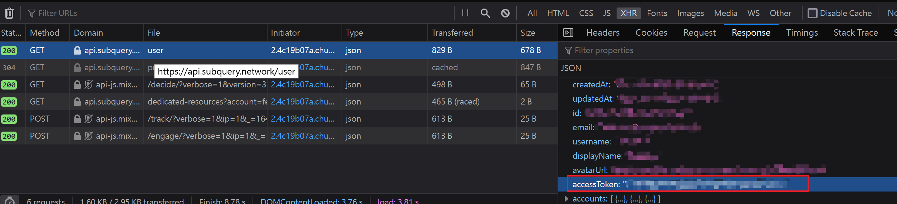

subquery-cli
===

Deploy subql use cli client. support choose custom branch or sub folder.

## Compile

```shell
cargo build --release
```

## Env

| Key           | Description                                                 |
| ------------- | ----------------------------------------------------------- |
| SUBQUERY_HOME | The subquery config file path, default is `$HOME/.subquery` |

## Usage

### Login

Because of Subquery only login with Github account. you need get `access_token` first.



When you get it. you can run

```text
subquery login --token <ACCESS_TOKEN>
```

After run this, will write a config file same with binary path.

### User

#### Info

```text
subquery user info

 ID     Z2lxxxxxxxxOTMy
 NAME   fewensa
 EMAIL  email@example.com
```

#### Orgs

```text
subquery user orgs

fewensa
org0
org1
```

### Project

#### List all projects

```text
subquery project list --org fewensa

fewensa/pangolin-abc
fewensa/pangolin-test
```

#### Create a project

```text
subquery project create -h

subquery-cli-project-create 0.1.0
Create a project

USAGE:
    subquery-cli project create [OPTIONS] --key <key> --org <org> --repo <repo>

FLAGS:
    -h, --help       Prints help information
    -V, --version    Prints version information

OPTIONS:
        --description <description>    Description
        --hide <hide>                  Hide project in explorer, default is true
        --key <key>                    Project key
        --name <name>                  Project name, if not set it, default use key
        --org <org>                    Org name
        --repo <repo>                  Github repository url
        --subtitle <subtitle>          Subtitle
```

```text
subquery project create --org fewensa --key project-key --repo https://github.com/fewensa/subql
```

#### Update a project

```text
subquery project update -h

subquery-cli-project-update 0.1.0
Update a project

USAGE:
    subquery-cli project update [OPTIONS] --key <key> --org <org>

FLAGS:
    -h, --help       Prints help information
    -V, --version    Prints version information

OPTIONS:
        --description <description>    Description
        --hide <hide>                  Hide project in explorer
        --key <key>                    Project name
        --name <name>
        --org <org>                    Org name
        --subtitle <subtitle>          Subtitle
```

```text
subquery project update --org fewensa --key project-key --name project-rename --subtitle "Some project" --hide false
```

### Deployment

```text
subquery deployment list --org fewensa --key project-key

Stage

  Name                Value
  Id                  8528
  Project key         fewensa/project-key
  Commit              522ac**********29e43565685e7bf7
  Status              Running
  Cluster             jm
  Indexer image       onfinality/subql-node:v0.25.3
  Query image         onfinality/subql-query:v0.8.0
  Sub folder
  Endpoint
  Dict endpoint
  Query url           https://api.subquery.network/sq/fewensa/project-key__ZmV3Z
  Query cluster url   https://jm.api.subquery.network/sq/fewensa/project-key__ZmV3Z
```

you can also use json output

```text
subquery deployment list --org fewensa --key project-key -o json

[
  {
    "createdAt": "2021-12-16T05:19:15.235Z",
    "updatedAt": "2021-12-16T06:12:17.030Z",
    "id": 8528,
    "projectKey": "fewensa/project_key",
    "version": "522ac**********29e43565685e7bf7",
    "status": "running",
    "cluster": "jm",
    "indexerImage": "onfinality/subql-node:v0.25.3",
    "queryImage": "onfinality/subql-query:v0.8.0",
    "subFolder": "",
    "endpoint": "",
    "dictEndpoint": "",
    "type": "stage",
    "queryUrl": "https://api.subquery.network/sq/fewensa/project-key__ZmV3Z",
    "queryClusterUrl": "https://jm.api.subquery.network/sq/fewensa/project-key__ZmV3Z",
    "metadata": {
      "role": "master",
      "isSample": false,
      "enableTimestamp": false,
      "indexerBatchSize": 1
    }
  }
]
```

#### Deploy

```text
subquery deployment deploy -h

subquery-cli-deployment-deploy 0.1.0
Deploy

USAGE:
    subquery-cli deployment deploy [OPTIONS] --branch <branch> --key <key> --org <org>

FLAGS:
    -h, --help       Prints help information
    -V, --version    Prints version information

OPTIONS:
        --branch <branch>                                  Which branch of git repository
        --commit <commit>                                  The commit of branch, default is latest commit id
        --dict-endpoint <dict-endpoint>                    Override Dictionary endpoint
        --endpoint <endpoint>                              Override Network endpoint
        --indexer-image-version <indexer-image-version>    Indexer Version (@subql/node)
        --key <key>                                        Project key
        --org <org>                                        Org name
    -o, --output <output>                                  Output format [default: raw]
        --query-image-version <query-image-version>        Query Version (@subql/query)
        --sub-folder <sub-folder>                          Sub folder
        --type <type>                                      Deployment type [default: stage]
```

```text
subquery deployment deploy --org fewensa --key project-key --branch master

fewensa/project-key

  Name              Value
  Key               fewensa/project-key
  Account           fewensa
  Name              project-key
  Network
  Deployed          false
  Logo
  Subtitle          subtile
  Description       subtile
  Repository        https://github.com/darwinia-network/wormhole-subql
  Hide              true
  Dedicate db key
  Query url         https://api.subquery.network/sq/fewensa/pangolin-test


Stage

  Name                Value
  Id                  8528
  Project key         fewensa/project-key
  Commit              522ac**********29e43565685e7bf7
  Status              Processing
  Cluster             jm
  Indexer image       onfinality/subql-node:v0.25.3
  Query image         onfinality/subql-query:v0.8.0
  Sub folder
  Endpoint
  Dict endpoint
  Query url           https://api.subquery.network/sq/fewensa/project-key__ZmV3Z
  Query cluster url   https://jm.api.subquery.network/sq/fewensa/project-key__ZmV3Z
```

#### Redeploy

```text
subquery deployment redeploy --org fewensa --key project-key --id 8110 --branch master --sub-folder subfolder

Success
```

#### Sync status

```text
subquery deployment sync-status --org fewensa --key project --id 8110 --rolling

total_entities: 3 target_block: 242295 processing_block: 120447 percent: 49.71% [1]
total_entities: 3 target_block: 242295 processing_block: 120448 percent: 49.71% [2]
total_entities: 3 target_block: 242295 processing_block: 120448 percent: 49.71% [3]
total_entities: 3 target_block: 242295 processing_block: 120449 percent: 49.71% [4]
total_entities: 3 target_block: 242295 processing_block: 120450 percent: 49.71% [5]
total_entities: 3 target_block: 242297 processing_block: 120450 percent: 49.71% [6]
total_entities: 3 target_block: 242297 processing_block: 120451 percent: 49.71% [7]
total_entities: 3 target_block: 242297 processing_block: 120452 percent: 49.71% [8]
total_entities: 3 target_block: 242297 processing_block: 120452 percent: 49.71% [9]
total_entities: 3 target_block: 242297 processing_block: 120453 percent: 49.71% [10]
total_entities: 3 target_block: 242297 processing_block: 120454 percent: 49.71% [11]
total_entities: 3 target_block: 242297 processing_block: 120455 percent: 49.71% [12]
total_entities: 3 target_block: 242297 processing_block: 120455 percent: 49.71% [13]
total_entities: 3 target_block: 242298 processing_block: 120456 percent: 49.71% [14]
total_entities: 3 target_block: 242298 processing_block: 120457 percent: 49.71% [15]
```

### Logs

```text
subquery --org fewensa --key project-key --stage --rolling

[info] [2021-12-16 06:39:55.064 UTC] [fetch] fetch block [120820,120820], total 1 blocks
[info] [2021-12-16 06:39:56.741 UTC] [fetch] fetch block [120821,120821], total 1 blocks
[info] [2021-12-16 06:39:58.419 UTC] [fetch] fetch block [120822,120822], total 1 blocks
[info] [2021-12-16 06:40:00.100 UTC] [fetch] fetch block [120823,120823], total 1 blocks
[info] [2021-12-16 06:40:00.652 UTC] [benchmark] 0.59 bps, target: #242403, current: #120823, estimate time: 2 days 09 hours 12 mins
[info] [2021-12-16 06:40:01.783 UTC] [fetch] fetch block [120824,120824], total 1 blocks
[info] [2021-12-16 06:40:03.470 UTC] [fetch] fetch block [120825,120825], total 1 blocks
[info] [2021-12-16 06:40:05.146 UTC] [fetch] fetch block [120826,120826], total 1 blocks
[info] [2021-12-16 06:40:06.865 UTC] [fetch] fetch block [120827,120827], total 1 blocks
[info] [2021-12-16 06:40:08.542 UTC] [fetch] fetch block [120828,120828], total 1 blocks
[info] [2021-12-16 06:40:10.222 UTC] [fetch] fetch block [120829,120829], total 1 blocks
[info] [2021-12-16 06:40:11.920 UTC] [fetch] fetch block [120830,120830], total 1 blocks
[info] [2021-12-16 06:40:13.599 UTC] [fetch] fetch block [120831,120831], total 1 blocks
[info] [2021-12-16 06:40:15.269 UTC] [fetch] fetch block [120832,120832], total 1 blocks
[info] [2021-12-16 06:40:15.652 UTC] [benchmark] 0.59 bps, target: #242405, current: #120832, estimate time: 2 days 08 hours 56 mins
[info] [2021-12-16 06:40:16.949 UTC] [fetch] fetch block [120833,120833], total 1 blocks
[info] [2021-12-16 06:40:18.631 UTC] [fetch] fetch block [120834,120834], total 1 blocks
[info] [2021-12-16 06:40:20.304 UTC] [fetch] fetch block [120835,120835], total 1 blocks
[info] [2021-12-16 06:40:21.993 UTC] [fetch] fetch block [120836,120836], total 1 blocks
[info] [2021-12-16 06:40:23.751 UTC] [fetch] fetch block [120837,120837], total 1 blocks
[info] [2021-12-16 06:40:25.454 UTC] [fetch] fetch block [120838,120838], total 1 blocks
[info] [2021-12-16 06:40:27.140 UTC] [fetch] fetch block [120839,120839], total 1 blocks
[info] [2021-12-16 06:40:28.816 UTC] [fetch] fetch block [120840,120840], total 1 blocks
[info] [2021-12-16 06:40:30.489 UTC] [fetch] fetch block [120841,120841], total 1 blocks
[info] [2021-12-16 06:40:30.651 UTC] [benchmark] 0.59 bps, target: #242408, current: #120841, estimate time: 2 days 09 hours 03 mins
[info] [2021-12-16 06:40:32.158 UTC] [fetch] fetch block [120842,120842], total 1 blocks
```
